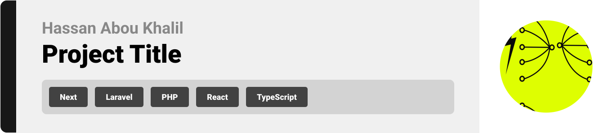
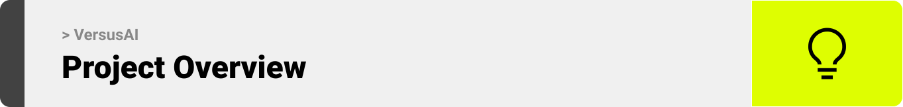
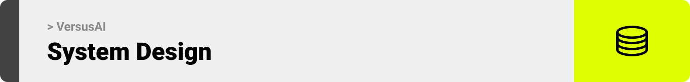
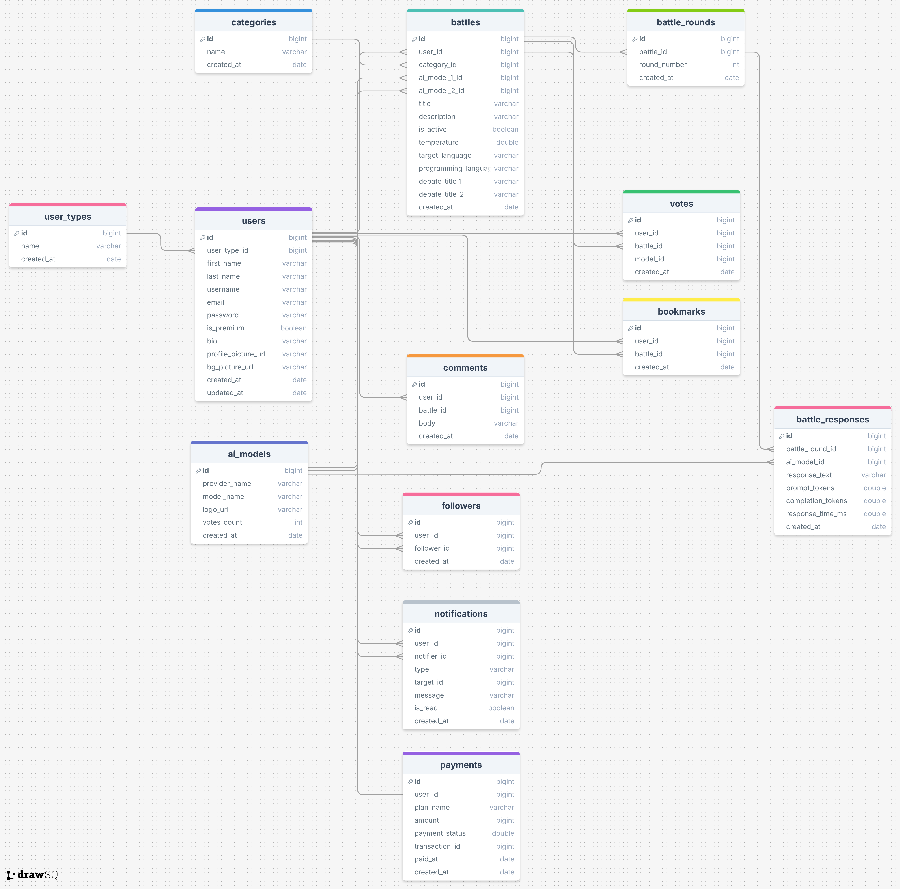
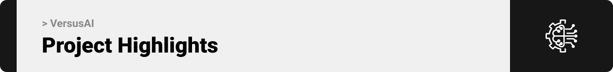
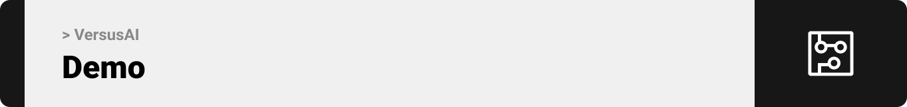
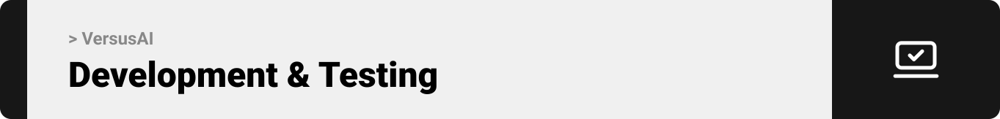

  

<!-- project overview -->

> VersusAI is a project where users can create and explore battles between different AI models, vote on the best results, and see which AI performs better in different tasks.

  

<!-- System Design -->

### ER diagram

  

<!-- Project Highlights -->

### Some features included in VersusAI

- Create Battles - Premium members, who upgrade through Stripe, can set up head-to-head contests between supported AI models.

- Vote on Battles - Cast your vote and watch the results update instantly.

- Explore Battles - Browse finished battles and catch up on the highlights.

- See the Stats - Check analytics to see which model performed better and how quickly it responded.

- Pay Securely - Subscribe through Stripe; every transaction is quick and safe.

  

<!-- Demo -->

### User Screens (Mobile)

| Login screen                            | Register screen                       | Register screen                       |
| --------------------------------------- | ------------------------------------- | ------------------------------------- |
|  |  |  |

### Admin Screens (Web)

| Login screen                            | Register screen                       |
| --------------------------------------- | ------------------------------------- |
|  |  |

  

<!-- Development & Testing -->

### Add Title Here

| Services                                | Validation                            | Testing                               |
| --------------------------------------- | ------------------------------------- | ------------------------------------- |
|  |  |  |

  

<!-- Deployment -->

### Add Title Here

- Description here.

| Postman API 1                           | Postman API 2                         | Postman API 3                         |
| --------------------------------------- | ------------------------------------- | ------------------------------------- |
|  |  |  |

  
