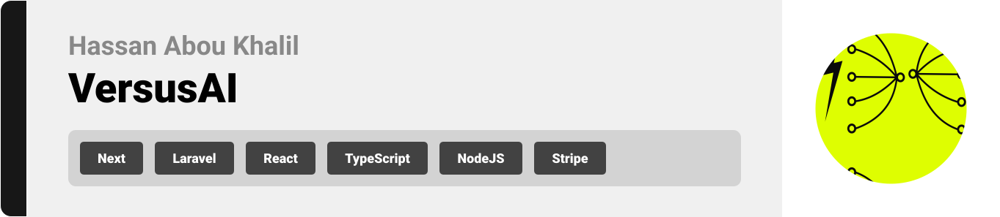
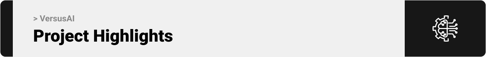

  

<!-- project overview -->

> VersusAI is a project where users can create and explore battles between different AI models, vote on the best results, and see which AI performs better in different tasks.

  

<!-- System Design -->

### ER diagram

|                                                            |
| ---------------------------------------------------------- |
|  |
|                                                            |

### Component diagram

|                                                                   |
| ----------------------------------------------------------------- |
|  |
|                                                                   |

  

<!-- Project Highlights -->

### Some features included in VersusAI

- Create Battles - Premium members, who upgrade through Stripe, can set up head-to-head contests between supported AI models.

- Vote on Battles - Cast your vote and watch the results update instantly.

- Explore Battles - Browse finished battles and catch up on the highlights.

- See the Stats - Check analytics to see which model performed better and how quickly it responded.

- Pay Securely - Subscribe through Stripe; every transaction is quick and safe.

 

  

<!-- Demo -->

### Screens (Web)

| Hero section in the landing page screen     |
| ------------------------------------------- |
|  |

| Login screen                              | Register screen                        |
| ----------------------------------------- | -------------------------------------- |
|  |  |

| Explore battles page                                | Create a battle                                    |
| --------------------------------------------------- | -------------------------------------------------- |
|  |  |

| First round of the Text Summarization battle           | Second round of the Text Summarization battle          |
| ------------------------------------------------------ | ------------------------------------------------------ |
|  |  |

| Analytics                                        | Response time                                    |
| ------------------------------------------------ | ------------------------------------------------ |
|  |  |

| Completion tokens                                                                          | Completion tokens |
| ------------------------------------------------------------------------------------------ | ----------------- |
|   |

  

<!-- Development & Testing -->

| Service                                                   | Validation                                                 | Testing                                                 |
| --------------------------------------------------------- | ---------------------------------------------------------- | ------------------------------------------------------- |
|  |  |  |

  

<!-- AI Development -->

### Prompts

| The prompt responsible for the code response    | The prompt responsible for the text translation response |
| ----------------------------------------------- | -------------------------------------------------------- |
|  |             |

### Using Prism

  

<!-- Deployment -->

### Some API calls from Postman

| API to summarize a text                      |
| -------------------------------------------- |
|  |

| API to create AI battle                    |
| ------------------------------------------ |
|  |

  
