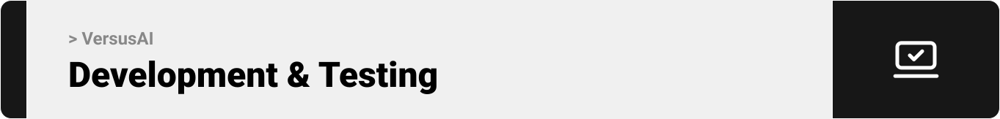

# VersusAI – Battle of the LLMs 🤺

[](LICENSE)

> **VersusAI** – pit today’s top LLMs against each other in real-time battles with live voting & analytics.
> <br><br>

## Quick Start

```bash
# Clone & bootstrap
git clone https://github.com/yourname/versusai.git && cd versusai
docker compose up -d        # spins up Laravel + MySQL + Next.js

# Browse the app
open http://localhost:3000  # or just click the link

# Backend
cd api && cp .env.example .env
composer install && php artisan key:generate && php artisan migrate --seed

# Frontend
cd ../web && pnpm install && pnpm dev

```

<br><br>

<!-- project overview -->


> VersusAI is a project where users can create and explore battles between different AI models, vote on the best results, and see which AI performs better in different tasks.

<br><br>

<!-- System Design -->


### ER diagram

<p align="center">  </p>

### Component diagram

<p align="center">  </p>
<br><br>

<!-- Project Highlights -->


## ✨ Features

- ⚔️ **Create Battles** – Premium members can set up head-to-head contests between supported AI models.

- 🗳️ **Vote on Battles** – Cast your vote and watch results update instantly.

- 🔍 **Explore Battles** – Browse finished battles and highlights

- 📊 **See the Stats** – Analytics on model performance and response times.

- 💳 **Pay Securely** – Subscribe through Stripe; every transaction is quick and safe.

- ⏱️ **Real-Time** – All updates and analytics are live.

- 🖼️ **Rich Visuals** – Diagrams, charts, and GIFs for every step.

<br>

## 🛠️ Tech Stack

| Frontend | Backend | Database | Payments | Containerization |
| -------- | ------- | -------- | -------- | ---------------- |
| Next.js  | Laravel | MySQL    | Stripe   |

<br>


<br><br>

<!-- Demo -->


### Screens (Web)

<details open> <summary>30-second walkthrough (GIF)</summary>

| Hero section in the landing page screen     |
| ------------------------------------------- |
|  |

</details>

| Login screen                              | Register screen                        |
| ----------------------------------------- | -------------------------------------- |
|  |  |

| Explore battles page                                | Create a battle                                    |
| --------------------------------------------------- | -------------------------------------------------- |
|  |  |

| First round of the Text Summarization battle           | Second round of the Text Summarization battle          |
| ------------------------------------------------------ | ------------------------------------------------------ |
|  |  |

| Real-time voting (updated directly in all pages) |
| ------------------------------------------------ |
|  |

| Response time graph                         | Completion tokens graph                       |
| ------------------------------------------- | --------------------------------------------- |
|  |  |

| Real-time voting (updated directly in all pages) |
| ------------------------------------------------ |
|     |

<br><br>

<!-- Development & Testing -->


| Service                                                   | Validation                                                 | Testing                                                 |
| --------------------------------------------------------- | ---------------------------------------------------------- | ------------------------------------------------------- |
|  |  |  |

<br><br>

<!-- AI Development -->


### Prompts

| The prompt responsible for the code response    | The prompt responsible for the text translation response |
| ----------------------------------------------- | -------------------------------------------------------- |
|  |             |

### Using Prism


<br><br>

<!-- Deployment -->


### Some API calls from Postman

| API to summarize a text                      |
| -------------------------------------------- |
|  |

| API to create AI battle                    |
| ------------------------------------------ |
|  |

<br><br>
