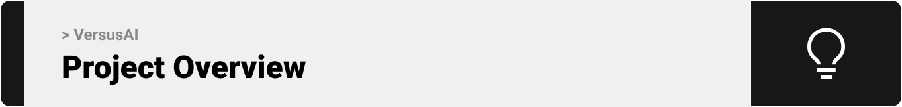

# VersusAI – Battle of the LLMs 🤺

> **VersusAI** – pit today's top LLMs against each other in real-time battles with live voting & analytics.
>  

<!-- project overview -->

> VersusAI is a project where users can create and explore battles between different AI models, vote on the best results, and see which AI performs better in different tasks.

 

  

 

<!-- System Design -->

### ER Diagram

  

### Component diagram

  

  

<!-- Project Highlights -->

 

## ✨ Features

- ⚔️ **Create Battles** – Premium members can set up head-to-head contests between supported AI models.

- 🗳️ **Vote on Battles** – Cast your vote and watch results update instantly.

- 🔍 **Explore Battles** – Browse finished battles and highlights

- 📊 **See the Stats** – Analytics on model performance and response times.

- 💳 **Pay Securely** – Subscribe through Stripe; every transaction is quick and safe.

- ⏱️ **Real-Time** – All updates and analytics are live.

- 🖼️ **Rich Visuals** – Diagrams, charts, and GIFs for every step.

 

## 🛠️ Tech Stack

| Frontend | Backend | Database | Payments | Containerization |
| -------- | ------- | -------- | -------- | ---------------- |
| Next.js  | Laravel | MySQL    | Stripe   | Docker Compose   |

 

<!-- Demo -->

## 🖼️ Screenshots and GIFS

| Hero section in the landing page screen     |
| ------------------------------------------- |
|  |

| Login screen                              | Register screen                        |
| ----------------------------------------- | -------------------------------------- |
|  |  |

| Explore battles page                                | Create a battle                                    |
| --------------------------------------------------- | -------------------------------------------------- |
|  |  |

| First round of the Text Summarization battle           | Second round of the Text Summarization battle          |
| ------------------------------------------------------ | ------------------------------------------------------ |
|  |  |

| Statistics                                       |
| ------------------------------------------------ |
|  |

| Response time graph                         | Completion tokens graph                       |
| ------------------------------------------- | --------------------------------------------- |
|  |  |

| Real-time voting (updated directly in all pages) |
| ------------------------------------------------ |
|     |

  

<!-- Development & Testing -->

| Service                                                   | Validation                                                 | Testing                                                 |
| --------------------------------------------------------- | ---------------------------------------------------------- | ------------------------------------------------------- |
|  |  |  |

  

<!-- AI Development -->

### Prompts

| The prompt responsible for the code response    |
| ----------------------------------------------- |
|  |

| The prompt responsible for the text translation response |
| -------------------------------------------------------- |
|             |

### AI Integration Using Prism

  

<!-- Deployment -->

### Some API calls from Postman

| API to summarize a text                      |
| -------------------------------------------- |
|  |

| API to create AI battle                    |
| ------------------------------------------ |
|  |

  
